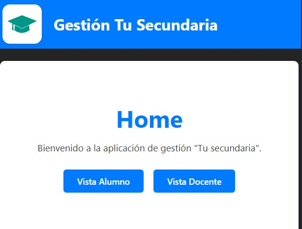
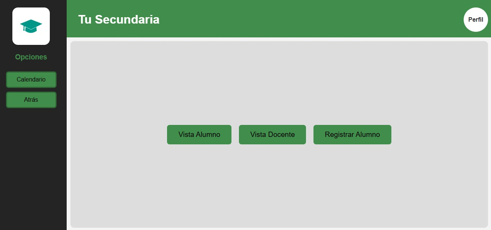
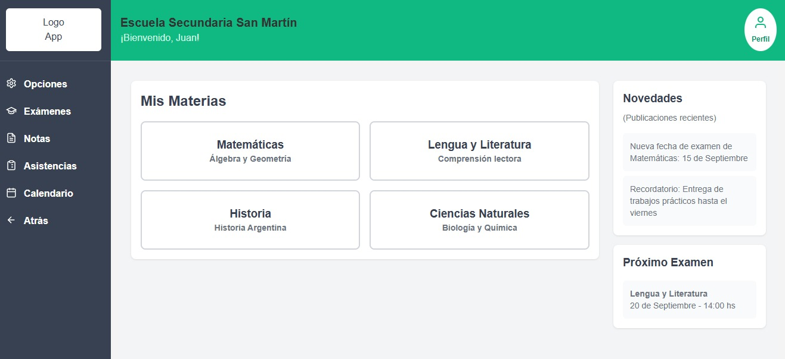

# Minuta 5

**Período de la Minuta:** 07/08/2025 - 29/08/2025  
**Fecha de Generación de la Minuta:** DD/MM/2025  
**Modalidad de Trabajo:** Asincrónica con Comunicación Continua y Reuniones Virtuales Sincrónicas.

---

## 1. Asistentes / Participantes

**07/08/2025 (Reunión Virtual):**

- `Achares, Jonatan Francisco Angel`
- `Correa, Martiniano León`
- `Varrenti, Lara`

**14/08/2025 (Reunion Virtual):**

- `Achares, Jonatan Francisco Angel`
- `Correa, Martiniano León`
- `Varrenti, Lara`

**21/08/2025 (Reunion Virtual):**

- `Achares, Jonatan Francisco Angel`
- `Correa, Martiniano León`
- `Varrenti, Lara`

**29/08/2025 (Reunion Virtual):**

- `Achares, Jonatan Francisco Angel`
- `Correa, Martiniano León`
- `Varrenti, Lara`

---

## 2. Temas Tratados y Decisiones Clave

- **07/08/2025 - Reunión Virtual - Informe de Avance en FrontEnd y próximos pasos:**

  - **Tema:** Presentación y discusión del primer avance funcional del frontend, incluyendo la integración con el backend.
  - **Decisión:** Se revisó el código del frontend y se confirmó que la conexión con el backend mediante fetch funcionaba correctamente, mostrando los datos de las materias.
  - **Acciones Pendientes:**
    - Continuar con la reestructuración del frontend y la creación de los demás componentes y rutas.
    - Avanzar con el desarrollo de los CRUDs dependientes Dictado y Examen.

- **14/08/2025 - Reunión Virtual Semanal: Actualizacion del MD**

  - **Tema:** Refinamiento y optimización del modelo de dominio y creación inicial de CRUDs dependientes.
  - **Decisión:** Modificamos el modelo de dominio para separar la funcionalidad. Se reacomodaron dependencias entre clases y se priorizó la parte del modelo necesaria para la "regularidad", posponiendo la funcionalidades más avanzadas para "aprobación directa". Además se implementaron codeando de manera grupal los modulos Dictado y Exámen como los CRUDs dependientes a trabajar.
  - **Acciones Pendientes:**
    - Avance en el Front-End: Priorizar el desarrollo del front-end, que se encuentra rezagado.
    - Refinar dependencias: Rever lo hecho en los CRUDs dependientes y continuamente analizar si las dependencias están bien impementadas.

- **21/08/2025 - Reunión Virtual Semanal: Bosquejo Front**

  - **Tema:** Revisión del modelo de dominio nuevamente y diseño de vistas del front-end.
  - **Decisión:** Se debatió hasta aclarar las dudas sobre las dependencias del modelo de dominio, consolidando la comprensión del equipo. Además, se definieron las vistas finales de la página web utilizando Figma, logrando un boceto que cumple con las expectativas de todos los integrantes del grupo.
  - **Acciones Pendientes:**
    - Implementación de Vistas: Traducir el diseño de Figma a código con ayuda de React y aplicar los cambios al repositorio del front-end.

- **28/08/2025 - Reunión Virtual Semanal: Informe de avance**

  - **Tema:** Avance significativo inicial en el desarrollo del front-end.
  - **Decisión:** Se ha completado una gran parte de la implementación del front-end, creando varios componentes y páginas nuevas. La interfaz ahora es muy similar a la maquetación de Figma, y se logró la funcionalidad clave de mostrar las materias de la base de datos en un contenedor con un diseño estético y funcional.
  - **Acciones Pendientes:**
    - Funcionalidad CRUD: Continuar con la implementación de las operaciones CRUD (Crear, Leer, Actualizar, Eliminar) en las materias y otras entidades para una interacción completa con la base de datos.

---

## 3. Avances del Proyecto

### 3.1. Frontend

- **Cambios Realizados**: Se implementó el archivo App.jsx como componente principal de la aplicación React, gestionando la estructura de rutas mediante react-router-dom. El layout principal fue reestructurado con MainContent y Sidebar para mejorar la organización visual. Se corrigieron los estilos y la responsividad en App.css.

- **Adiciones**:
  1. Se creó una página de inicio ("Home") que actúa como pantalla principal, presentando un botón que permite navegar al listado de materias.
  2. Se desarrolló una página específica accesible mediante la ruta /materias, en la cual se realiza una petición GET al backend para obtener y mostrar el listado completo de materias. En la misma página de materias, se incorporó un buscador que permite consultar una materia específica por su ID, mostrando sus detalles si es encontrada.
  3. Se crearon los componentes DashboardAlumno y DashboardDocente con rutas separadas, y se conectó el primero al backend para mostrar las materias en un componente CardMateria.
  4. Se agregó un componente Header reutilizable y un Sidebar para la navegación.
- **Sustracciones:**
  1. Se eliminó el archivo index.js y styles.css ya que dejaron de ser parte de la estructura base del proyecto.
  2. Se descartó el modelo de página inicial que tiene el buscador de materias, no se eliminó el código.

### 3.2. Backend

- **Cambios Realizados**: Se reestructuró la lógica de los controladores y servicios para mejorar la modularidad y el mantenimiento del código. Se corrigieron errores de instanciación y binding en las rutas de la entidad Materia.
- **Adiciones**:
  1. Se creó una estructura modular para las clases curso, dictado, examen, materia y persona.
  2. Se implementaron los modelos y servicios con Sequelize.
  3. Se agregaron rutas RESTful para las operaciones CRUD de todas las entidades principales.
- **Sustracciones**: Se eliminó el middleware que servía el frontend directamente al backend ya que no era lo que se pedía.

---

## 4. Nuevas Tecnologías / Herramientas Exploradas o Integradas

- **React:** Biblioteca de JavaScript para crear interfaces de usuario, basada en componentes reutilizables que gestionan su propio estado.
- **Vite:** Herramienta de construcción que ofrece un servidor de desarrollo ultrarrápido y carga instantánea de los cambios, optimizando el flujo de trabajo en proyectos de frontend.
- **React Router DOM:** Biblioteca de enrutamiento que permite la navegación entre las "páginas" de una aplicación de React sin necesidad de recargar la página completa.
- **Figma:** Herramienta de diseño colaborativo para la creación de interfaces de usuario y maquetación web.

---

## 5. Obstáculos / Desafíos Identificados

- **Confusión en el Modelo de Dominio:** Persisten desafíos en la comprensión de las dependencias y relaciones entre las entidades del modelo de dominio, lo que ha requerido múltiples revisiones.

- **Sincronización Backend-Frontend:** A pesar de la conexión inicial, se deben revisar constantemente las declaraciones de las clases y relaciones para el óptimo funcionamiento de la aplicación.

---

## 6. Próximos Pasos y Objetivos para la Siguiente Minuta

- **Implementación de CRUDs:** Continuar con la implementación de las operaciones CRUD (Crear, Leer, Actualizar, Eliminar) en las materias y otras entidades para una interacción completa con la base de datos.

  - **Responsable(s):** Todos los integrantes.
  - **Fecha Límite Sugerida: 30/09/25**

- **Desarrollo del Frontend:** Continuar con el desarrollo de las distintas páginas del front-end, traduciendo completamente el diseño de Figma a código.

  - **Responsable(s):** Todos los integrantes.
  - **Fecha Límite Sugerida: 30/09/25**

- **Corrección de la Estructura de Clases:** Finalizar la corrección de la estructura de clases del backend para asegurar que la base de datos pueda ser utilizada correctamente.

  - **Responsable(s):** Todos los integrantes.
  - **Fecha Límite Sugerida: 30/09/25**

---

## 7. Anexos / Referencias

- [Link al figma con bocetos varios del aspecto de nuestra app](https://www.figma.com/board/oUaUHwxO2fSAVq2QyWpoiH/Gesti%C3%B3n-Tu-Secundaria?node-id=0-1&t=FmJeufpHW3P2uUtS-1)
- Screenshots de distintos aspectos que tuvo nuestra app con el tiempo:
  - 
  - 
  - 

---
